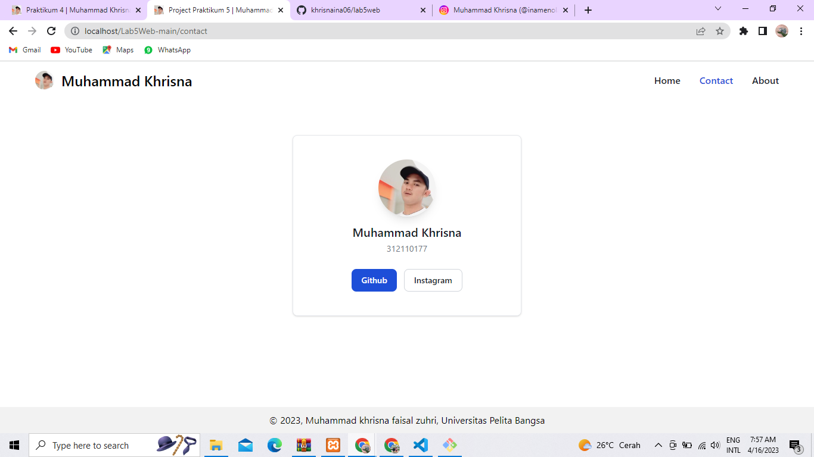

# PRAKTIKUM 4 (PHP Modular)

**_Nama: Muhammad Khrisna_** <br/>
**_Nim : 312110177_** <br/>
**_Kelas : TI.21.A2_** <br/>

<br/><br/>

## **Home**


<br/>

## **Update**


<br/>

## **Contact**


<br/>

## **About**


<br/>

## **Directory Tree**
```bash
Lab3Web
│ 
├──.htaccess
├──index.php
├──README.md
│
├──assets
│   │
│   ├──images
│   │   ├──laptop.jpg
│   │   ├──oppo.jpg
│   │   ├──samsung.jpg
│   │   └──xiaomi.jpg
│   │
│   └──sql
│       └──latihan1.sql
│
├──includes
│   ├──footer.php
│   └──header.php
│
├──requires
│   ├──connection.php
│   └──function.php
│
├──screenshot
│   ├──About.JPG
│   ├──Contact.JPG
│   ├──Create.JPG
│   ├──Home.JPG
│   └──Update.JPG
│
└──views
    ├──404.php
    ├──about.php
    ├──contact.php
    ├──create.php
    ├──delete.php
    ├──home.php
    └──update.php
```
